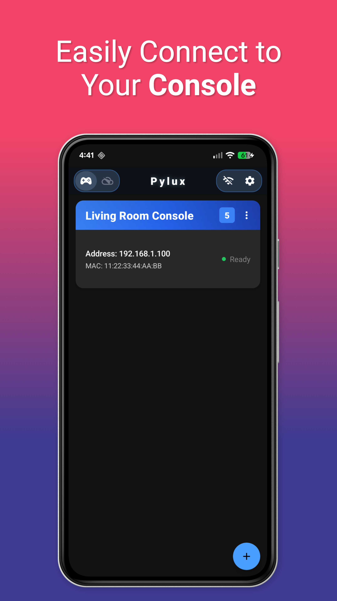

# Pylux

Pylux is a free, community-built, open source hobby project forked from the popular Chiaki project. It focuses on maintaining internet remote play across platforms and aims to keep the app easy to access through major app marketplaces.

## Why Pylux?

I told ChatGPT to name the project and promised I'd actually use the first thing it said. It said Pylux. So now we're stuck with it, and that's on me, not you.

## Screenshots

  
  
  
  

## Features

- Internet Play
- Remote play
- Cross-platform builds for straightforward deployment
- Modern UI with touch-friendly controls where it matters
- Automatic console discovery and registration

## Contributing

Fork the repo, create a branch, and open a pull request targeting `release/beta`. When merged, CI automatically builds and deploys to all platforms (Google Play, TestFlight, App Store Connect, Dropbox).

See [CONTRIBUTING.md](CONTRIBUTING.md) for the full workflow, what to work on, and local development setup.

## What needs work

- **iOS** needs the most work — cleanup, hardening, and refactors are all in scope.
- **Android** is more stable but still benefits from fixes and polish.
- **Desktop (Qt)** is where merge pain with [upstream Chiaki](https://github.com/streetpea/chiaki-ng) shows up most. Prefer adding new code in new files when practical and skip sweeping rewrites that block pulling upstream fixes.
- **Cherry-picks from upstream** are welcome. If you spot something upstream has that Pylux is missing, open an issue or try adding it yourself.

Vibe or LLM-assisted updates are welcome — it is the future, after all. But please follow good coding standards and fully test your changes before submitting. Much of iOS was built this way after the maintainer lost motivation and decided to speedrun it, so the code works but let's just say there's room for improvement.

## Legal & responsible use

Pylux works with games and content you already own or are licensed to use, using hardware you own and any valid platform accounts or subscriptions. It does not bypass copy protection or enable piracy.

This project is not endorsed or certified by the console manufacturer. All trademarks belong to their respective owners.

For questions about this project or responsible use, contact [forward.technologies.llc@gmail.com](mailto:forward.technologies.llc@gmail.com).

## Credits

Special thanks to the original Chiaki development team for their excellent work on the foundation of this project. This fork builds on their incredible foundation, aiming to bring internet play to more people through straightforward installs across platforms.
